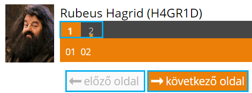
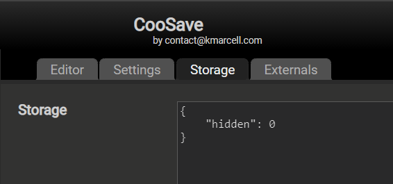

CooSave for CooSpace
====================

A **CooSave** kiegészítő hivatalos oldala.

A kiegészítővel a megírás időpontjában lementheted egy PDF fájlba a CooSpacen írt tesztjeidet, így azokat később bármikor átismételheted, visszaellenőrizheted magad.

## Verzió
*Legutolsó verzió: **1.0.0***

*Kiadás dátuma: **2021.10.09***

## Telepítés
A szkript támogatja a legtöbb modern böngészőt.

1. A használathoz szükség van a Tampermonkey kiegészítő letöltésére, amelyet megtehetsz az alábbi linkekről:
* [Google Chrome](https://chrome.google.com/webstore/detail/tampermonkey/dhdgffkkebhmkfjojejmpbldmpobfkfo)
* [Mozilla Firefox](https://addons.mozilla.org/en-US/firefox/addon/tampermonkey)
* [Microsoft Edge](https://microsoftedge.microsoft.com/insider-addons/detail/iikmkjmpaadaobahmlepeloendndfphd)
* [Opera](https://addons.opera.com/en/extensions/details/tampermonkey-beta)
* [Safari](https://apps.apple.com/us/app/tampermonkey/id1482490089)

2. A Tampermonkey kiegészítő telepítéséhez kattints [erre](https://github.com/kissmarcell/coosave/raw/main/coosave.user.js) a linkre.
3. A megnyíló ablakban kattints az *Install* gombra.
4. Innentől kezdve bármely teszt indításakor a szkript automatikusan mentést készít a tesztről, melyet bármikor elmenthetsz PDF-ként.

## Használat
A program a teszt írása közben automatikusan elmenti a kérdéseket és az éppen kijelölt válaszokat, melyekből gombnyomásra bármikor PDF dokumentumot készíthetsz. A program csak azokat a kérdéseket és válaszokat menti el, amelyeket már meglátogattál. A PDF dokumentum lementése a *Letöltés* gomb megnyomásával vagy a `Ctrl + Shift + s` billentyűkombináció egyidejű lenyomásával függvénnyel érhető el. Alapértelmezetten a *Letöltés* gomb megjelenik a felületen, amennyiben el szeretnéd rejteni, azt a `Ctrl + Shift + k`

>### Figyelmeztetés!
>A szkript **kizárólag** az alább világoskékkel jelölt gombokra való kattintáskor menti el azon kérdések és válaszok állapotát, amelyek azon oldalon találhatóak, amelyre a gombra való kattintás után jutottál. Ebből adódóan beküldés előtt érdemes átpörgetni a teszt összes oldalát a garantált mentés érdekében.\

### Mentés gomb elrejtése
Ha valamilyen okból nem szeretnéd, hogy a CooSpace vizsgafelületén megjelenjen a *Mentés* gomb, az alábbit kell tenned:
1. Nyisd meg a Tampermonkey beállításait.
2. Nyisd meg a CooSave addon beállításait.
3. Kattints a **Storage** gombra.
4. Írd át a `hidden` változó értékét 0-ról 1-re.

5. Kattints alul a **Save** gombra.
6. Töltsd újra, hogy megbizonyosodj róla, hogy a változtatás mentésre került.
Sikeres beállítás után a *CooSpace* felületén semmilyen jele nem lesz annak, hogy a *CooSave* éppen fut.

## Tervezett funkciók
* **1 oldalas teszt támogatása**: A szkript jelenleg a működési elvéből kifolyólag 1 oldalas *CooSpace* tesztek esetén csak a kérdéseket tudja elmenteni, a kitöltött válaszokat nem.

## Kapcsolat
Kérdés/ötlet esetén nyugodtan nyiss egy új issue-t vagy keress a [contact@kmarcell.com](mailto:contact@kmarcell.com) címen.

## Használt külső könyvtárak
* [html2canvas](https://github.com/niklasvh/html2canvas)
* [pdfkit](https://github.com/foliojs/pdfkit)
* [blob-stream](https://github.com/devongovett/blob-stream)

## Adatvédelmi nyilatkozat
Az kiegészítőben megadott személyes adatok nem kerülnek továbbításra és tárolásra idegen szerveren, kizárólag a te gépeden maradnak.

## Licensz
Az összes fájl ebben a tárolóban [MIT](https://en.wikipedia.org/wiki/MIT_License) licensz alatt került publikálásra,  a [LICENSE fájl](LICENSE) megtalálható a tároló főkönyvtárában.
